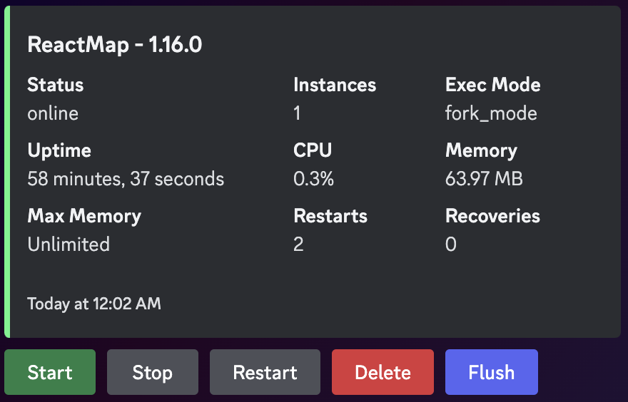

# discord-pm2

Discord bot to help manage apps with PM2 and view system information

  

## Installation

1. Clone the repository
2. Run `yarn install`
3. Create config file: `cp config/default.json config/local.json`
4. Edit `config/local.json` and add your bot token, clientId, and guildId
5. Run `yarn build`
6. Run `yarn start`

# Commands

## /pm2

- Supported commands:
  - `pm2 list`
  - `pm2 flush`
  - `pm2 start <app>`
  - `pm2 stop <app>`
  - `pm2 restart <app>`
- The command provides autocompletion for the available commands and apps
- Requires admin permissions

## /monitor

- `start <interval>`
  - Starts monitoring the system with the given interval in seconds
- `stop`
  - Stops monitoring the system
- `update`
  - Forces an early update of the monitor embeds
- Requires admin permissions

## /system

Returns system information:

- `CPU Usage`
- `Memory Usage`
- `Uptime`
- Requires admin permissions

# Development

1. Open two terminals
1. Start the TypeScript watcher with `yarn watch` in one terminal
1. Start the bot with `yarn dev` in the other terminal
1. Register new commands manually with `yarn register`
