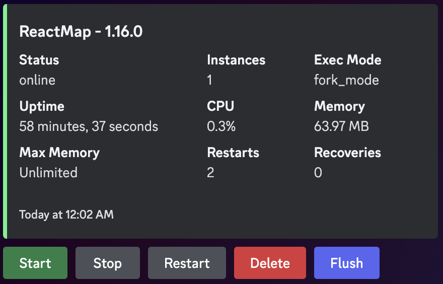

# discord-pm2

Discord bot to help manage apps with PM2 and view system information

  

## Installation

Requires [Bun](https://bun.com/).

1. Clone the repository
2. Run `bun install`
3. Create config file: `cp config/default.json config/local.json`
4. Edit `config/local.json` and add your bot token, clientId, and guildId
5. Run `bun start`

# Commands

## /pm2

- Process commands (require an `<app>` name):
  - `pm2 start <app>`
  - `pm2 stop <app>`
  - `pm2 restart <app>`
  - `pm2 reload <app>` — zero-downtime rolling restart (cluster mode)
  - `pm2 delete <app>`
  - `pm2 flush <app>` — clears the app's logs
- General commands (no `<app>` required):
  - `pm2 list` — lists every managed process as a rich embed
  - `pm2 dump` — saves the process list to `~/.pm2/dump.pm2` for resurrection on reboot (equivalent to `pm2 save`)
  - `pm2 reloadlogs` — rotates pm2's log file handles (use after `logrotate`)
- The command provides autocompletion for the available commands and apps
- Requires admin permissions

## /monitor

- `start <interval>`
  - Starts monitoring the system with the given interval in minutes (default: 1, minimum: 0.25)
- `stop`
  - Stops monitoring the system
- `update`
  - Forces an early update of the monitor embeds
- Requires admin permissions

## /system

Returns system information:

- `CPU Usage`
- `Memory Usage`
- `Uptime`
- Requires admin permissions

# Development

1. Start the bot in watch mode with `bun dev` (runs `bun --watch src/index.ts`, restarts on save)
1. Register new commands manually with `bun register`
